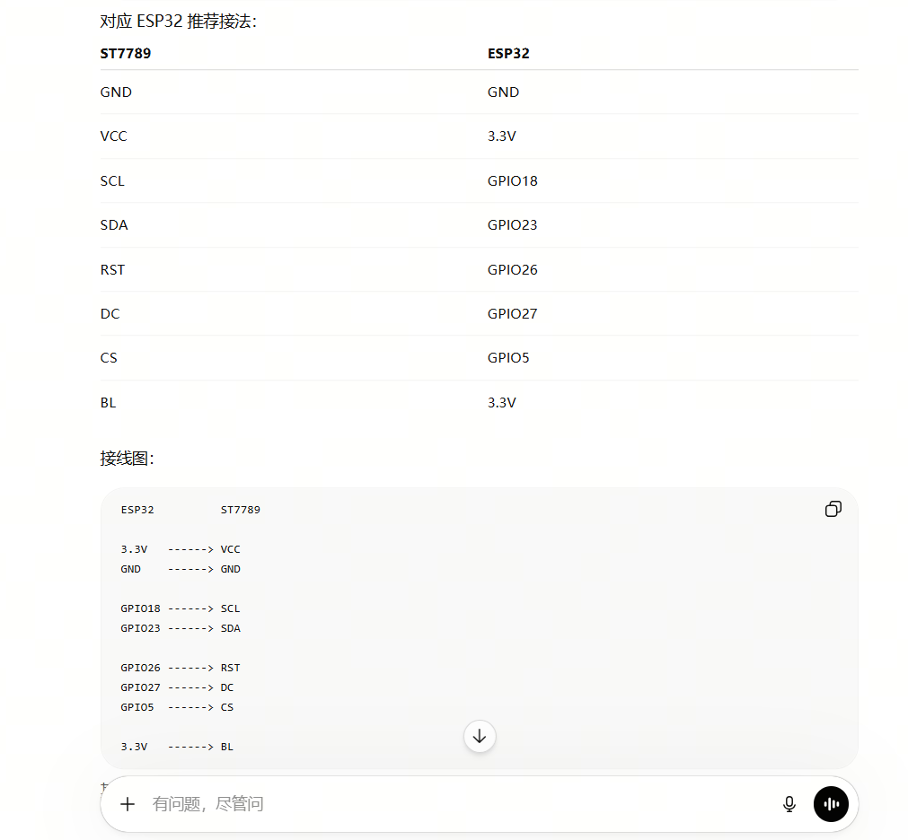
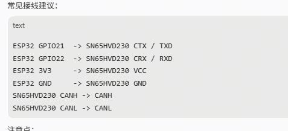
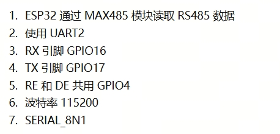
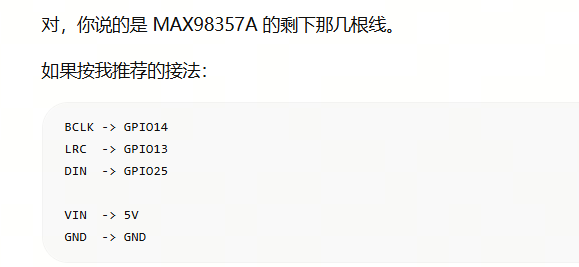
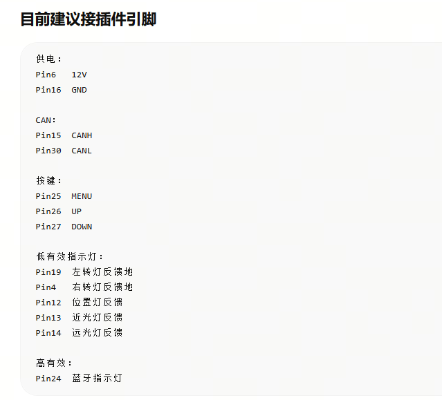
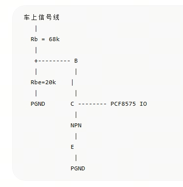
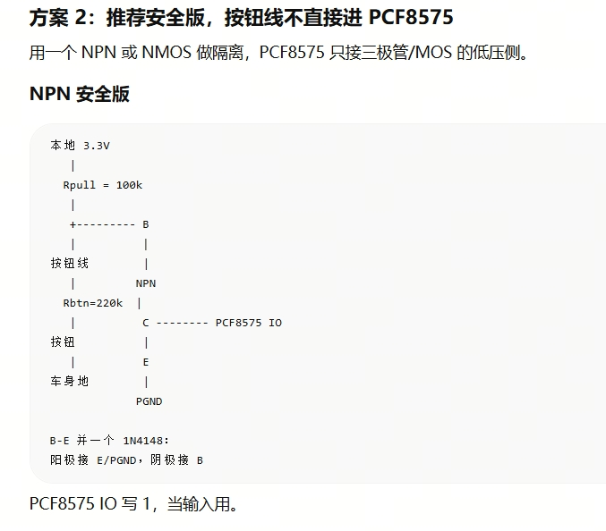

# ESP32 Vehicle Dashboard

基于 ESP32 的 CAN / RS485 车辆仪表固件发布仓库。

当前发布版本：`v0.1.5`

## 主要功能

- ST7789 240 × 240 彩色仪表显示
- CAN、RS485 车辆数据接入
- 速度、挡位、电量、功率、里程和时间显示
- 灯光、转向、充电、故障、TCS、HDC、ABS 等状态提示
- PCF8575 硬线输入和按键操作
- WiFi 与 Android 设备连接
- WiFi OTA 固件升级
- 可选 MAX98357A I2S 音频输出

## 下载固件

请从 [GitHub Releases](https://github.com/xmz28/esp32-vehicle-dashboard/releases/latest) 下载最新版：

- `firmware-0.1.5.bin`
- `firmware-user-guide-zh-CN.md`（固件用户使用说明）

> `firmware-0.1.5.bin` 是应用固件，适合通过设备已有的 OTA 页面升级。全新空白 ESP32 首次烧录还需要 Bootloader、分区表和 OTA 数据分区。

## 使用说明

完整硬件、IO、接线、操作和 OTA 说明：

- [固件用户使用说明](docs/固件用户使用说明.md)

## 接线参考

### ESP32 GPIO

### TFT ST7789

### CAN 收发器

### RS485

### MAX98357A 音频

### 仪表接插件

### 硬线输入保护

### 按键输入保护

## 实物照片

`assets/photos/` 用于存放整机、屏幕、PCB 和安装效果照片。当前版本暂未加入清晰的实物照片。

## 重要安全说明

- 车辆 12V、48V、60V 等电源或信号不得直接接入 ESP32 或 PCF8575。
- CAN 必须经过 CAN 收发器，CANH/CANL 不得直接接 ESP32。
- 5V RS485 模块必须确认输出电平与 ESP32 兼容。
- GPIO19 仅作为电源控制信号，不能直接带动继电器或大电流负载。
- 上电前请检查供电电压、极性、共地和总线终端电阻。

## 项目状态

此仓库当前用于发布固件、接线资料和用户文档，暂不包含完整源代码。
